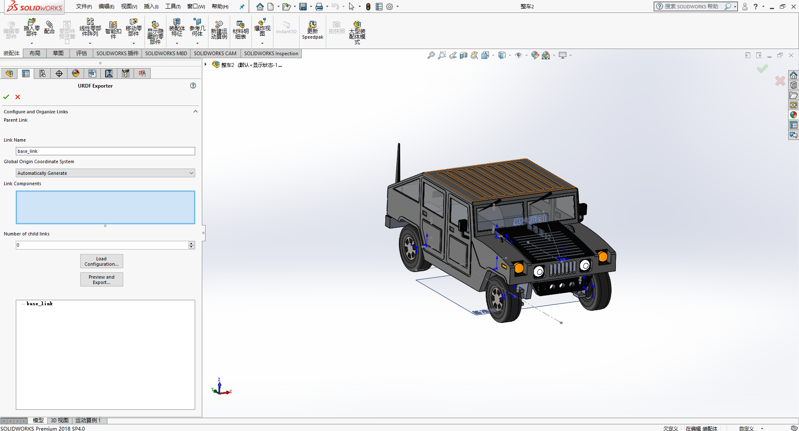
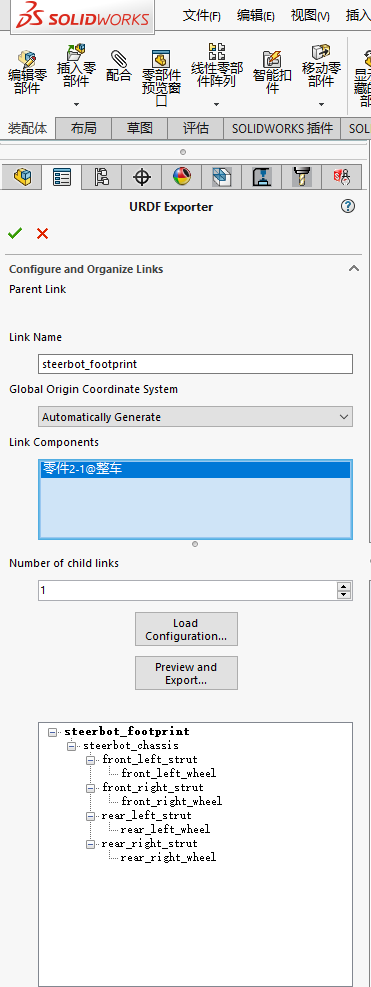
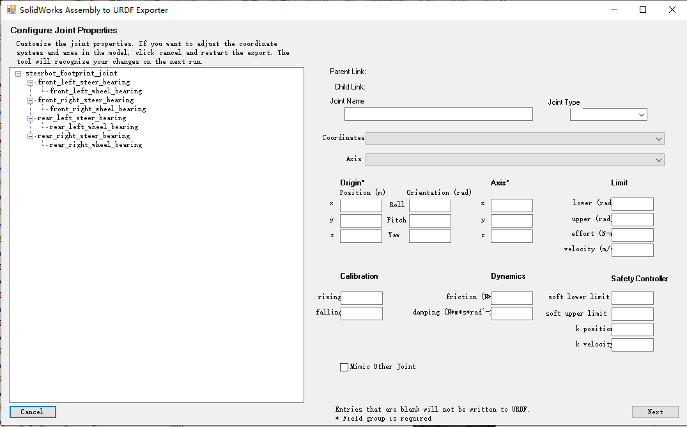
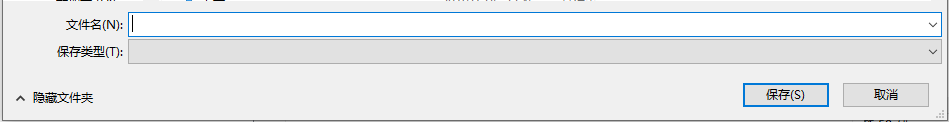

## **solidwork导出URDF的教程**

1.安装sw2urdf的插件

2.打开solidworks，在菜单栏的“齿轮”的下拉菜单下，选择“插件”，出现如图界面，你可以看到一个SW2URDF项目，勾选。

3.开始绘制你的零件图，完成装配关系。

4.在装配关系完成后，在菜单栏中的“工具>File>Export as URDF”

5.导出URDF的时候可以分为”自动导出“或者“手动导出”，为了避免设计结构太过复杂，建议手动建立坐标系和坐标轴。

6.建立手动坐标系的过程主要利用solidworks偏移平面和画中心轴，这样就可以实现坐标轴的建立。

7.在如图的位置输出urdf的link的名字和选择合适的坐标系，并且选择相应的结构。

8.选择好结构后的效果如图

9.设置好结构后，选择“Preview and Export”，出现joint的校核，校核所有joint的关节是否正确。

10.选择“下一步”，我们校核所有的link，最后输出，注意保存文件是不要出现中文，一般为小写字母或小写字母+数字。

11.至此一个urdf的模型导出完成。

